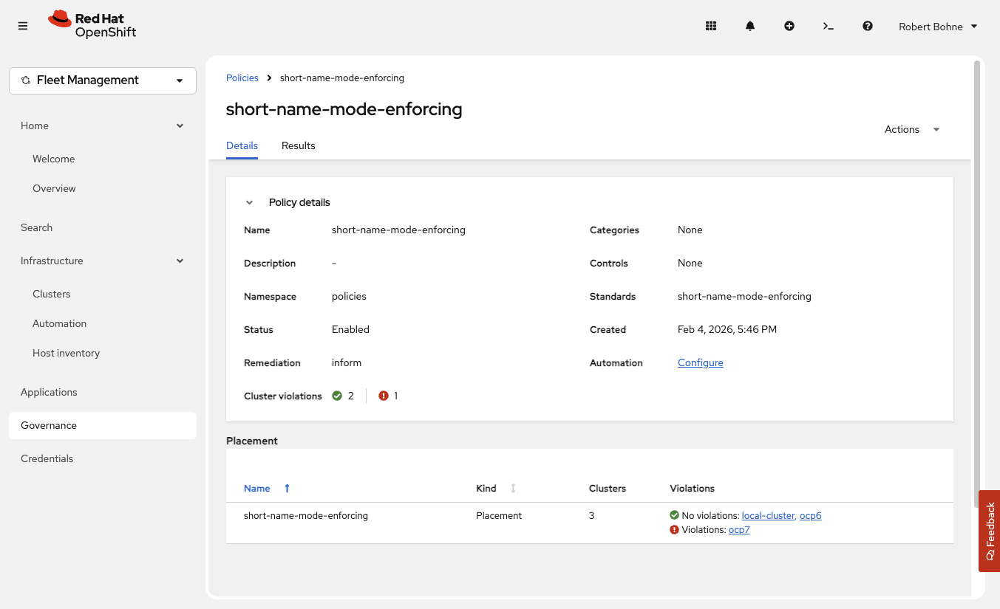

# Short Name Mode Enforcing Policy

This policy detects pods using container images with short names (unqualified image names) that may fail to pull in Kubernetes 1.34+ / OpenShift 4.21+ due to the new default `short-name-mode` being set to `enforcing`.

## Overview

Since Kubernetes 1.34 / OpenShift 4.21, the default `short-name-mode` is `enforcing`. This change affects how container images with short names (e.g., `nginx`, `redis`) are resolved, potentially causing image pull failures in non-interactive environments.

### Short-Name Mode Options

According to `containers-registries.conf(5)`, the `short-name-mode` option supports three modes:

- **enforcing**: If only one unqualified-search registry is set, use it as there is no ambiguity. If there is more than one registry and the user program is running in a terminal (i.e., stdout & stdin are a TTY), prompt the user to select one of the specified search registries. If the program is not running in a terminal, the ambiguity cannot be resolved which will lead to an error.

- **permissive**: Behaves as enforcing but does not lead to an error if the program is not running in a terminal. Instead, fallback to using all unqualified-search registries.

- **disabled**: Use all unqualified-search registries without prompting.

## Policy Details

This policy scans all pods in your cluster and identifies containers using images with short names (images that lack a domain/registry prefix, indicated by the absence of a dot in the first segment of the image path).

The policy uses `remediationAction: inform` with `severity: medium`, meaning it will report violations but not automatically remediate them.

## Usage

Apply the policy using the provided YAML file:

```bash
kubectl apply -f https://raw.githubusercontent.com/openshift-examples/policy-collection/refs/heads/main/short-name-mode-enforcing/policy-short-name-mode-enforcing.yaml
```

The policy will:
1. Scan all pods across all namespaces
2. Identify containers using short-name images
3. Report violations for pods that may fail to pull images in enforcing mode

## Example Output



## Additional Resources

- [Breaking Change: Kubernetes 1.34 Tightens Image Name Resolution Rules — What It Means for You](https://www.replicated.com/blog/breaking-change-kubernetes-1-34-tightens-image-name-resolution-rules----what-it-means-for-you)
- [Container image short names in Podman](https://www.redhat.com/en/blog/container-image-short-names)
- [CRI-O PR: image pull: enforce shortnames#9401](https://github.com/cri-o/cri-o/pull/9401)

## Remediation

To fix violations, update your pod specifications to use fully qualified image names:

- ❌ `image: nginx` → ✅ `image: docker.io/library/nginx:latest`
- ❌ `image: redis` → ✅ `image: docker.io/library/redis:latest`
- ❌ `image: myregistry/nginx` → ✅ `image: myregistry.com/myregistry/nginx:latest`